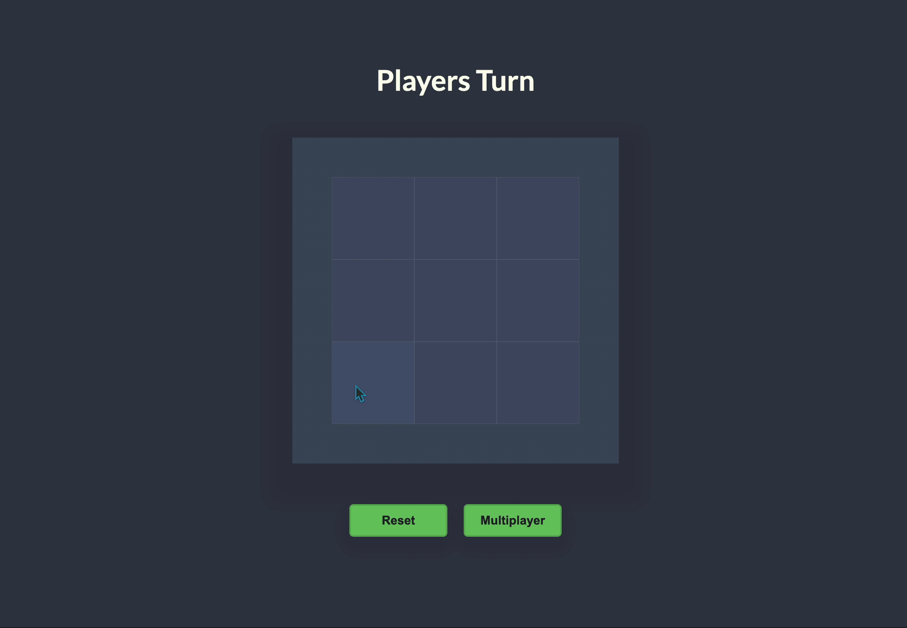
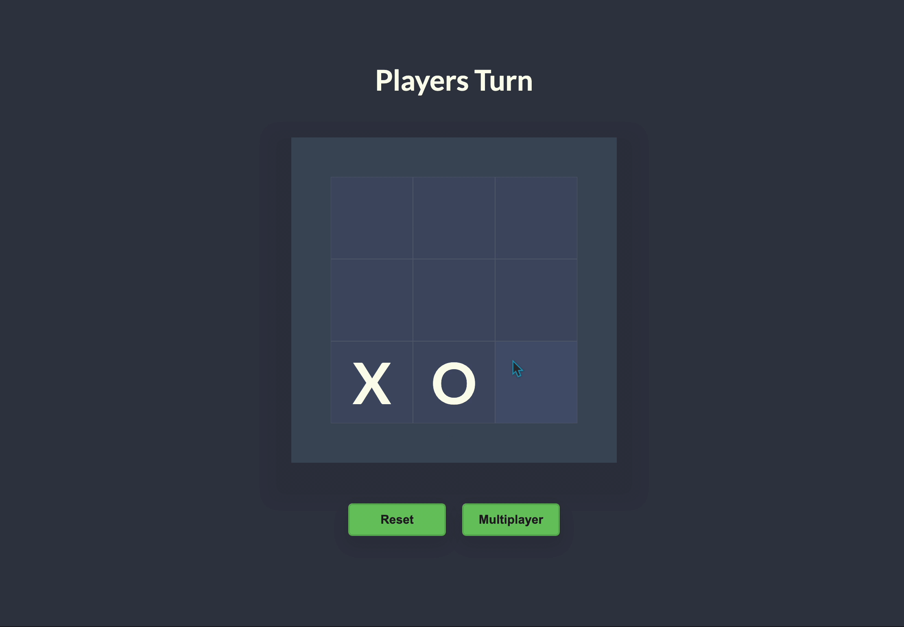
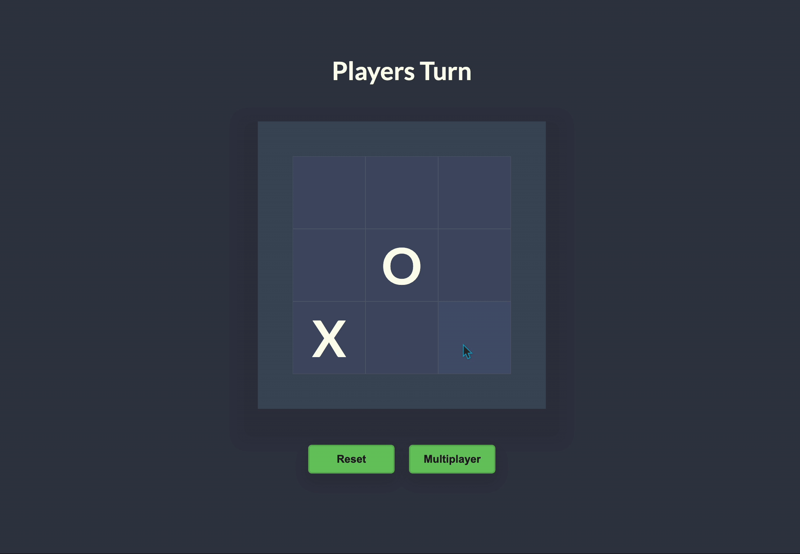

<!-- PROJECT LOGO -->
 

<h1 align="center">Tic Tac Code</h1>

  

   A Tic Tac Toe game against a random bot, or a local multiplayer mode.
     
    <a href="https://tictactoe.johnfarina.co">View Live Demo</a>

<!-- TABLE OF CONTENTS -->

  
Table of Contents

  <ol>
    <li>
      <a href="#about-the-project">About The Project</a>
      <ul>
        <li><a href="#built-with">Built With</a></li>
      </ul>
    </li>
    <li>
      <a href="#javascript">JavaScript</a>
      <ul>
        <li><a href="#game-state">Game State</a></li>
        <li><a href="#dom-table-interaction">DOM Table Interaction</a></li>
            <ul>
                <li><a href="#squares">Squares</a></li>
            </ul>
        <li><a href="#random-bot">Random Bot</a></li>
        <li><a href="#game-logic">Game Logic</a></li>
        <li><a href="#local-two-player">Local Two Player</a></li>
      </ul>
    </li>
    <li><a href="#design">Design</a></li>
       <ul>
            <li><a href="#table">Table</a></li>
            <li><a href="#animations">Animations</a></li>
        </ul>
    <li><a href="#usage">Usage</a></li>
    <li><a href="#contact">Contact</a></li>
  </ol>

<!-- ABOUT THE PROJECT -->
## About The Project

A web Tic Tac Toe game, play against a random bot. But it's best to play it two players locally with a friend!

### Built With
 - JavaScript
 - CSS

## JavaScript

### Game State
For the Game state, it relies on an array with 9 undefined values inside it, then each other request to this array is only changing each undefined to either a 1 or 0 depending on who is choosing it, and what spot.
I am also using a function to return more functions to easily add more spaces or remove them easily.

### DOM Table Interaction
Created all the squares and text using DOM made the project without any HTML, all event listener logics are inside the squares
Each table has a set amount of 9 squares and each square are doing its own logic on click, it first sees if the round number is even and if it is that means its Player Two's turn, etc. it then sends the value either 0 or 1 depending on which player clicks. Only allows to send values on the undefined squares  
Squares are also running a animationLoop on themselves to detect which value to display in the square. *Example: if the value is 0 it will be an X, etc.*

### Random Bot
The random guessing bot is using recursion to find an empty spot in the array. It guesses a random number through the length of the array, and if the spot it chose wasn't available *(undefined)* it will keep going until it finds one.

### Game Logic
For the game logic I am running a game loop every 500 ms with a function that watches the array to see if a certain Player value are in 3 spots, and the same with the other Player value. If one player matches all 3 spots in the array *(diagonal, across, down)* it triggers a win, if no player matches 3 spots it triggers a tie and no one wins

### Local Two Player
For local two players instead of running <a href="#random-bot">Random Bot</a> every other round I wait for another event in the squares on the Odd round to count for the other players turn, all code is the same other than that.

## Design
Went for a very minimal Tic Tac Toe design, creating a grid that revolves around the size of each square and an outer container to add more depth.

### **Animations**
For the win and loose I wanted to make it slightly more meaningful, so I added a green and red animation for the background color for win or loose. No animation plays when player ties
<!-- USAGE EXAMPLES -->
## Usage

To play against a bot all you have to do is press a square to start playing, and then the bot will choose their turn right after.  
For Local Two Player press the multiplayer button, Player one chooses their square and then Player Two chooses after. Play until you win!

<!-- CONTACT -->
## Contact

**John Farina** - johnfarina8@gmail.com

My Website - [johnfarina.co](https://johnfarina.co)

Project Link: [github.com/john-farina/TicTacCode](https://github.com/john-farina/TicTacCode)

(<a href="#readme-top">back to top</a>)

